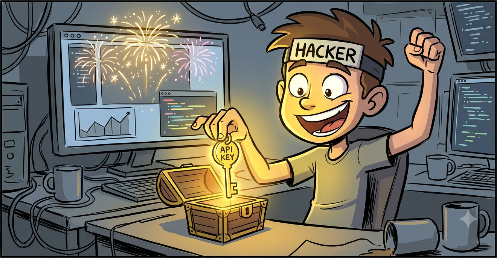
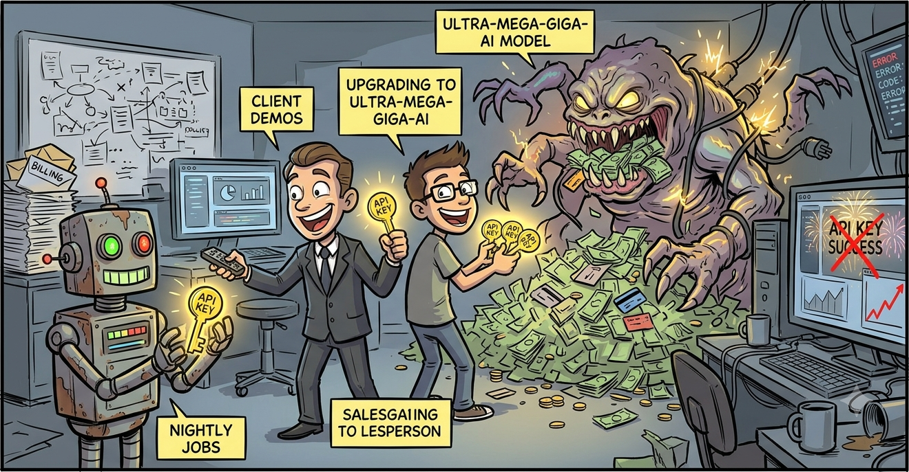
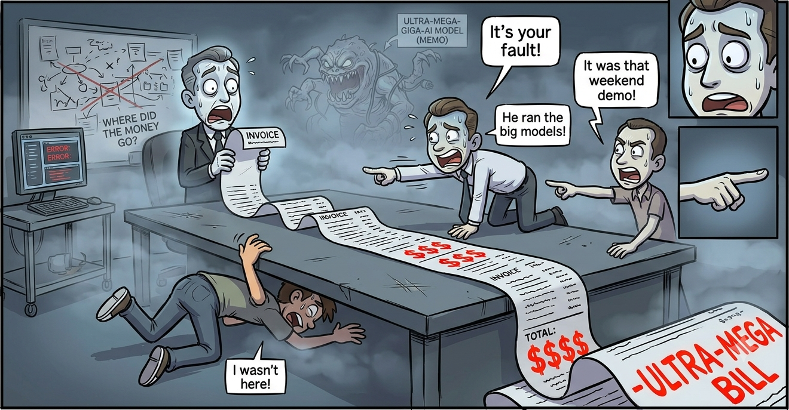
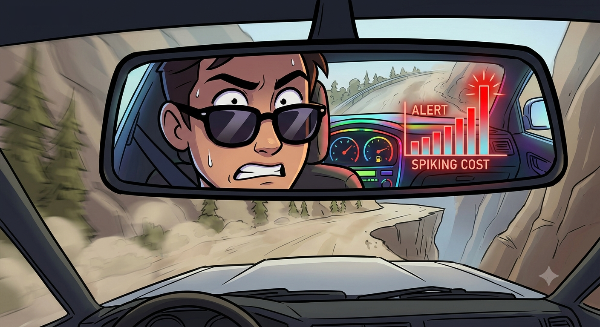
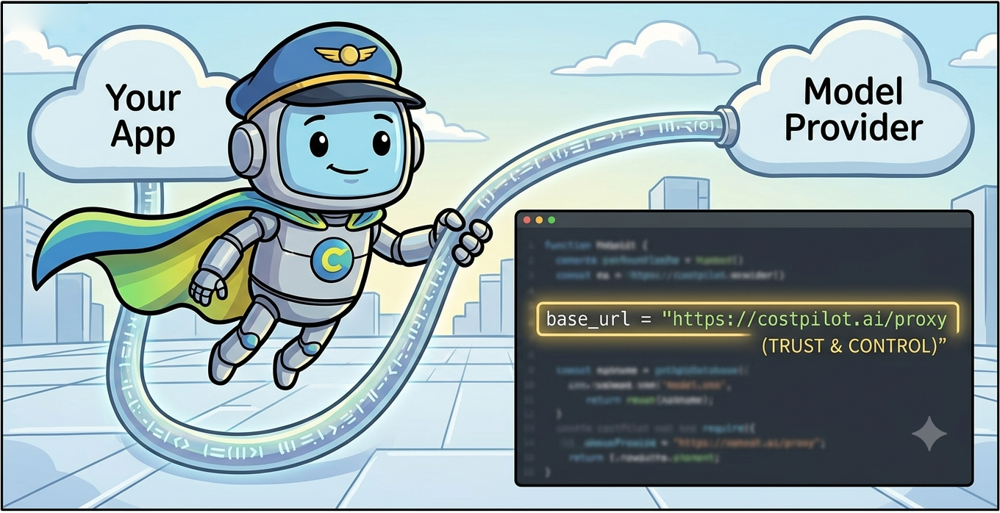
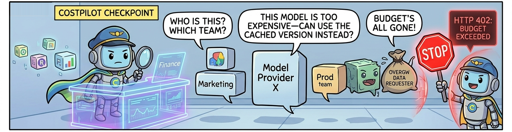
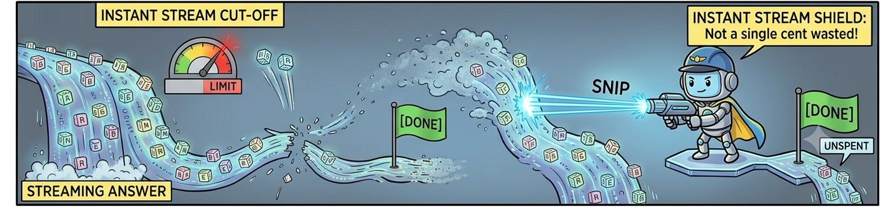
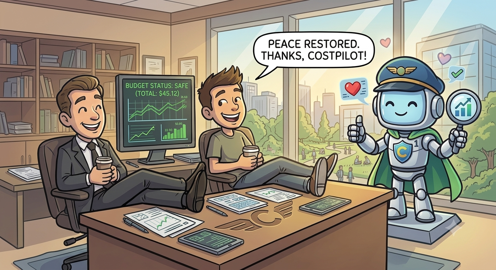

<div align="center">


# CostPilot

*Nobody knew who was spending the money.*<br>
*The bill only showed up at the end of the month, and by then it was gone.*

**An AI spending gateway that says no before the money is gone.**

<p>
&nbsp;&nbsp;&nbsp;&nbsp;&nbsp;
&nbsp;&nbsp;&nbsp;&nbsp;&nbsp;
&nbsp;&nbsp;&nbsp;&nbsp;&nbsp;
&nbsp;&nbsp;&nbsp;&nbsp;&nbsp;
&nbsp;&nbsp;&nbsp;&nbsp;&nbsp;

</p>

<a href="docs/README.md"><b>Setup and usage docs</b></a> · <a href="ROADMAP.md">Roadmap</a>

</div>

---

## The problem



**Month one.** Somebody drops an API key into a config file, ships a feature, and it works. Everyone is delighted.



**Month two.** That key is now in three more services, a nightly job and a client demo. Someone swaps in the bigger model because the small one felt dull. It costs fifteen times more. Nothing on the screen changes, so nobody notices.



**Month three.** The invoice arrives, and nobody in the room can say which team spent it, or on what. One key, one number, everybody's fingerprints.



Every tool we reached for was a dashboard. A dashboard is a rear view mirror. By the time a chart turns red, the money is already behind you.

> **No chart has ever refunded a dollar.**
> Seeing the spending was never the problem. Seeing was all we could do.

## The approach

Move the decision to where it matters: before the request leaves.



**One line on your side.** CostPilot sits between your app and the providers and speaks the OpenAI API, so all you change is `base_url`.



**Every request gets questioned first.** Who are you. May you use this model. Can a cache answer this instead. Is there budget left. If the answer is no, the request never leaves, and you get a `402` with a reason your code can read.



**The meter keeps running while it streams.** An answer can run far longer than anyone estimated, so when the spend crosses the line the stream is cut clean, with a real `finish_reason` and a `[DONE]`. You pay for what arrived. The overshoot is one chunk.



And it has to be invisible, or engineers will route around it. The whole check lands at 2.7 ms median under 100 requests per second.

## Architecture

Ten steps. Everything the request touches lights up as it goes.

<p align="center">
  
</p>

| # | step | decides |
|:---:|---|---|
| 1 | **Auth** | who you are, from a hashed key, never from a header you sent |
| 2 | **Normalize** | your OpenAI shaped request becomes one internal shape |
| 3 | **Policy** | allow, deny, quietly downgrade, or hold for a human |
| 4 | **Cache** | close enough to something already answered, serve it for free |
| 5 | **Route** | cheapest model that still clears the bar you asked for |
| 6 | **Budget** | reserve a *conservative hold* (heuristic max cost) across every scope that governs you — not the bill |
| 7 | **Forward** | out to OpenAI, Anthropic, Gemini, or the built in mock |
| 8 | **Meter** | estimate running cost to cut off mid-stream; provider token count wins the instant it arrives |
| 9 | **Ledger** | write the **exact** charge from provider-reported tokens × published price, once, even if you hang up |
| 10 | **Settle** | release the hold, publish, and leave an audit row explaining the verdict |

Exact billing vs the two heuristic sites (reserve, cutoff): [BENCHMARK.md — Money correctness](BENCHMARK.md#money-correctness--exact-billing-vs-heuristics).

## Quickstart

Docker is the only thing you need, and the demo costs nothing because the default upstream is a mock provider that lives inside the app.

```bash
git clone https://github.com/tanhoangkhoanguyen/CostPilot.git
cd CostPilot
docker compose up --build -d
```

Then walk through the ten minute demo, the CLI, the Python SDK, and going live with real providers here:

### → [Setup and usage docs](docs/README.md)

---

<div align="center">

<br>
<sub>Built because a dashboard has never stopped a single dollar from leaving.</sub>
</div>
